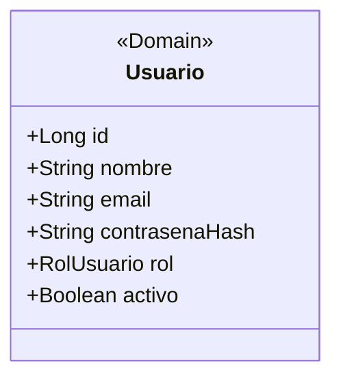

# TAREA 3 — Diagrama de clases (derivado)

## Rebanada seleccionada

Registro de un usuario.

## Diagrama de clases

## Capa

| Clase     | Capa    | Tipo    |
| --------- | ------- | ------- |
| `Usuario` | Dominio | Entidad |

## Comprobación

El diagrama contiene exclusivamente la clase `Usuario`, debido a que es la única clase del modelo de dominio que participa en la rebanada de registro de usuario seleccionada.

No se incluyen otras clases del modelo de dominio porque no participan en esta rebanada.

Las clases correspondientes a HTTP, aplicación y persistencia no se incluyen como clases del diagrama porque no existe un origen verificable para sus nombres concretos en los documentos fuente.

## VACÍOS DETECTADOS

No existe en los documentos fuente consultados un nombre verificable para una interfaz o puerto de persistencia ni para su implementación concreta.

Por esta razón no se inventan clases adicionales para representar esas fronteras.
