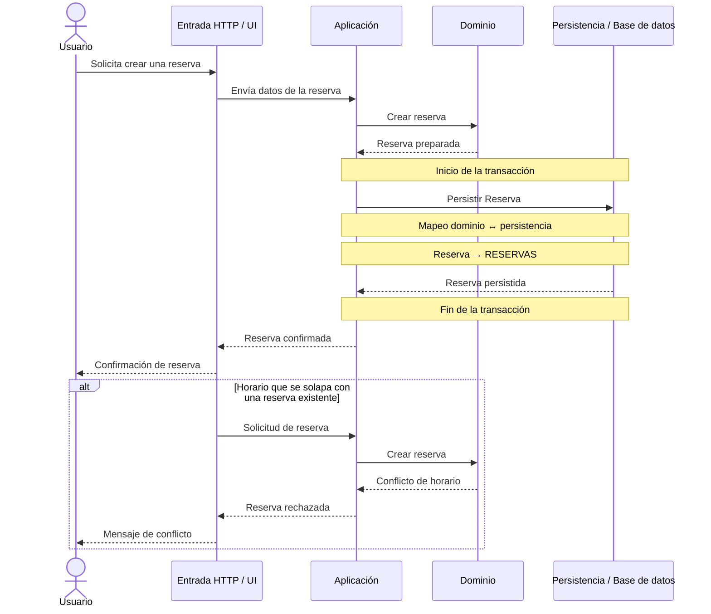

# TAREA 2 — Diagrama de secuencia

## Rebanada seleccionada

Crear una reserva.

## Diagrama de secuencia

## Comprobación

### 1. Representa solamente la rebanada elegida

El diagrama representa exclusivamente la creación de una reserva.

### 2. Comienza fuera del proceso

El flujo comienza con el actor externo `Usuario`.

### 3. Cruza las fronteras técnicas

La rebanada cruza las siguientes fronteras:

* Entrada HTTP / UI.
* Aplicación.
* Dominio.
* Persistencia / base de datos.

### 4. Llega a persistencia real

La solicitud llega hasta la persistencia de la reserva en la tabla `RESERVAS`.

### 5. Muestra el retorno

El resultado vuelve desde la base de datos hacia la aplicación, después hacia HTTP y finalmente al usuario.

### 6. Transacción

La transacción está señalada antes de la operación de persistencia y termina después de recibir el resultado.

### 7. Mapeo

El diagrama señala el mapeo entre la reserva del dominio y su representación persistente en `RESERVAS`.

### 8. Ruta de error mínima

Se incluye únicamente el caso en que el horario se solapa con una reserva existente.

### 9. Participantes

Se utiliza un participante por frontera técnica y no se agregan clases individuales como `Controller`, `Service` o `Repository`.

### 10. Concurrencia

La garantía de que ante 20 solicitudes simultáneas exactamente una quede confirmada y 19 sean rechazadas corresponde a la prueba del problema duro. El diagrama representa el flujo de creación de la reserva y la ruta de conflicto.
