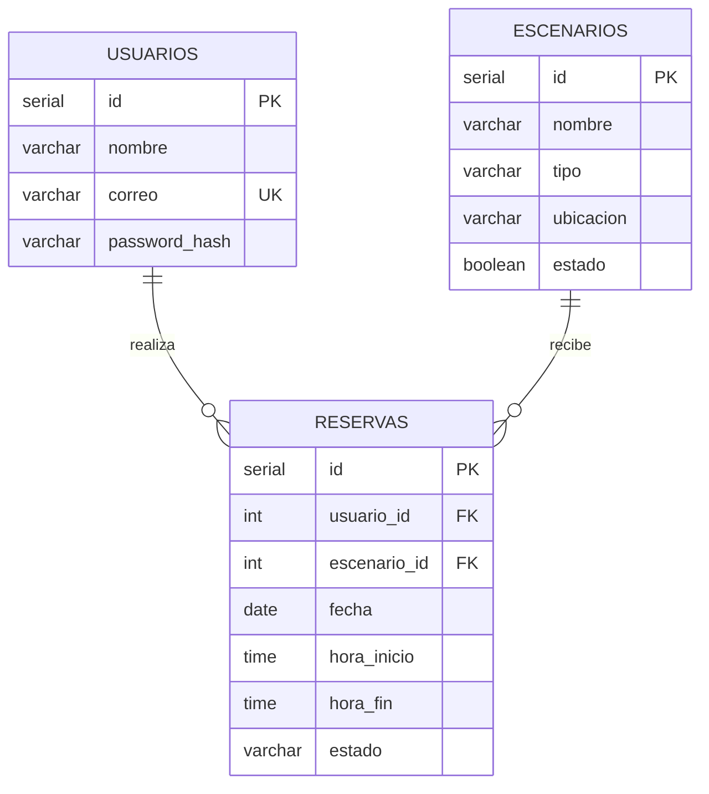

```mermaid
erDiagram
  USUARIOS ||--o{ RESERVAS : realiza
  ESCENARIOS ||--o{ RESERVAS : recibe
  USUARIOS {
    serial id PK
    varchar nombre
    varchar correo UK
    varchar password_hash
  }
  ESCENARIOS {
    serial id PK
    varchar nombre
    varchar tipo
    varchar ubicacion
    boolean estado
  }
  RESERVAS {
    serial id PK
    int usuario_id FK
    int escenario_id FK
    date fecha
    time hora_inicio
    time hora_fin
    varchar estado
  }
```