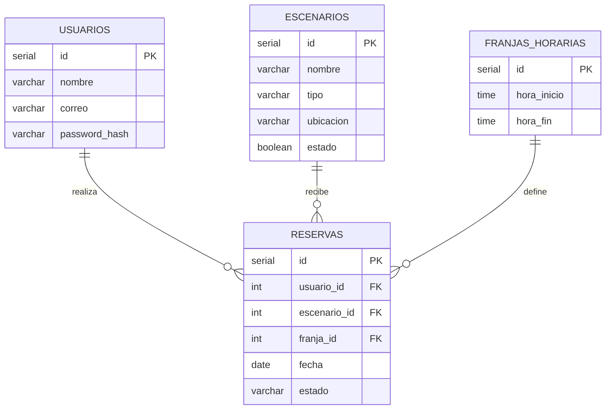

```mermaid
erDiagram
  USUARIOS ||--o{ RESERVAS : realiza
ESCENARIOS ||--o{ RESERVAS : recibe
FRANJAS_HORARIAS ||--o{ RESERVAS : define
USUARIOS {
serial id PK
varchar nombre
varchar correo 
varchar password_hash
}
ESCENARIOS {
serial id PK
varchar nombre
varchar tipo
varchar ubicacion
boolean estado
}
FRANJAS_HORARIAS {
serial id PK
time hora_inicio
time hora_fin
}
RESERVAS {
serial id PK
int usuario_id FK
int escenario_id FK
int franja_id FK
date fecha
varchar estado
  }
```