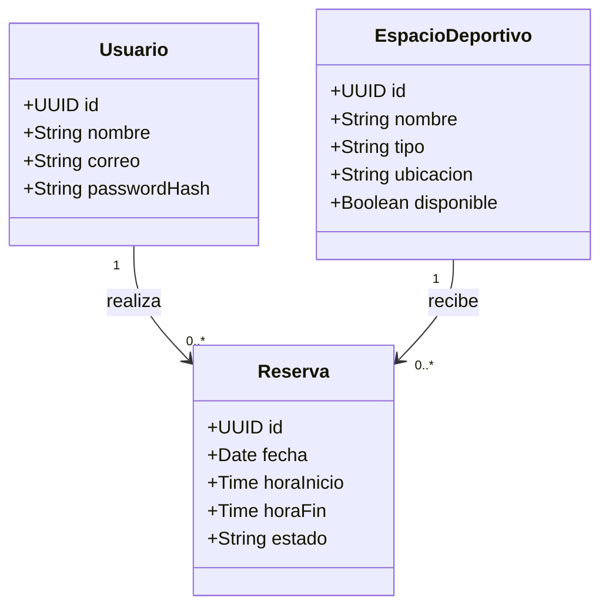

```mermaid
classDiagram
class Usuario {
+UUID id
+String nombre
+String correo
+String passwordHash
}
class EspacioDeportivo {
+UUID id
+String nombre
+String tipo
+String ubicacion
+Boolean disponible
}
class Reserva {
+UUID id
+Date fecha
+Time horaInicio
+Time horaFin
+String estado
}
Usuario "1" --> "0..*" Reserva : realiza
  EspacioDeportivo "1" --> "0..*" Reserva : recibe
```